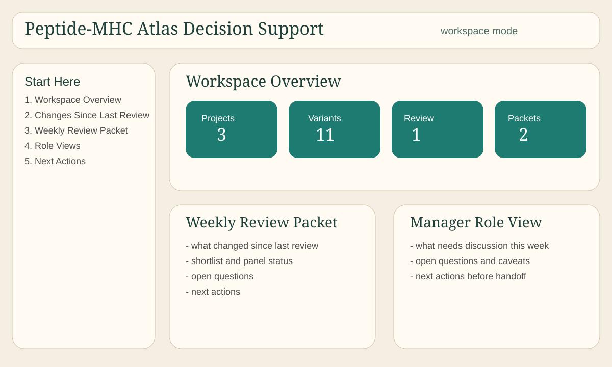

# Peptide-MHC Atlas Decision Platform

This repository is not just an AlphaFold analysis repo.

It is a local-first, interpretable decision platform for structure-guided experimental prioritization, with an initial wedge in peptide-MHC perturbation analysis.

It is best described as AlphaFold-family compatible analysis tooling, not as an AlphaFold 3-native pipeline. The current code prepares sequence-resolved inputs and analyzes common AlphaFold or ColabFold-style outputs conservatively, but it does not implement an AF3-specific workflow contract.

It is designed for teams who want more than raw structure predictions: a reproducible way to generate peptide-MHC mutation panels, compare mutants to WT, aggregate effects across alleles, carry shortlists and review history forward across meetings, and make experimental prioritization more evidence-linked and less ad hoc.



## Product Vision

Build an interpretable decision platform for structure-guided experimental prioritization.

Initial wedge:
- peptide-MHC perturbation analysis

What the current product seed is for:
- structure-guided experimental prioritization
- recurring scientific review workflows
- evidence-linked variant and panel review
- decision memory across weekly team cycles
- cleaner handoff between scientist, computational lead, and reviewer

## Public Data Strategy

- IPD-IMGT/HLA for official HLA allele sequences and local reference mappings
- IEDB exports for public peptide-allele assay and ligand data
- RCSB PDB for experimentally solved peptide-MHC structures and benchmark/reference structures
- AlphaFold DB only for monomeric reference/support use cases, not as peptide-MHC complex truth
- lightweight synthetic demo artifacts built on top of public-derived project outputs for pilot and workflow demos


## Why This Repo Exists

There is a recurring gap in peptide-MHC projects:

- one tool prepares FASTA files
- another tool runs AlphaFold or ColabFold
- a notebook parses a few structures
- a separate slide deck or figure folder captures the conclusions

This repository is meant to close that gap with one coherent workflow.

Its core idea is simple:

- treat peptide-MHC perturbation studies as a comparative analysis problem
- keep the outputs interpretable
- stay explicit about missing data and scientific limits
- make the results reusable in papers, talks, notebooks, and collaborator handoffs

It started as an input-preparation scaffold and now supports:

- allele-aware mutant panel generation
- class-I multichain input construction
- defensive AlphaFold or ColabFold output parsing
- within-allele structural contact analysis
- cross-allele tolerance and pocket-signature comparison
- reporting, publication-bundle export, case studies, and exploratory hypothesis generation
- transparent variant prioritization, robustness checks, benchmarking hooks, and compact mutation-panel design
- a local interactive analyst app with scenario analysis, evidence drilldown, demo projects, and scenario exports
- installable packaging, unified CLI entrypoints, Docker/devcontainer support, and demo-ready onboarding docs
- pilot-user review workflows with queues, shortlists, feedback capture, checklists, handoff bundles, and session logging
- multi-project workspace inventories, weekly review packets, role-oriented exports, project history, open questions, and decision packets
- program memory, decision lineage, recurring-question summaries, reusable workflow templates, and review-cycle comparisons across workspaces
- multi-cycle decision summaries, optional downstream outcome tracking, rationale carry-forward, and conservative workflow-effectiveness summaries

The project is intentionally conservative. It does not claim binding affinity prediction, immunogenicity prediction, or experimental validation. Structural summaries are presented as transparent derived features from predicted models.

## Elevator Pitch

This is a reproducible peptide-MHC comparative structural analysis framework that turns mutation panels and AlphaFold or ColabFold outputs into interpretable WT-relative, cross-allele, and publication-oriented structural summaries.

## Who This Is For

- small biotech discovery teams
- translational immunology groups
- computational biology leads running recurring review cycles
- scientist-manager workflows that need clearer shortlist memory and next-action planning
- high-agency labs evaluating mutation panels and structural perturbation evidence

## What Problem It Solves

Without a workflow layer, these projects usually turn into:

- one-off notebooks
- screenshots and folders of structures
- scattered slide conclusions
- unclear shortlist history
- ad hoc manager summaries that are disconnected from evidence

This repo replaces that with a local, evidence-linked review workflow:

- ranked outputs tied back to source evidence
- review queues and shortlists
- role-specific exports
- weekly review packets
- decision packets
- next actions and open questions
- workspace-level program memory

## Documentation Map

- Overview and quick start: [README.md](README.md)
- Detailed project specification: [docs/SPEC.md](docs/SPEC.md)
- Current feature inventory: [docs/FEATURES.md](docs/FEATURES.md)
- Module and pipeline architecture: [docs/ARCHITECTURE.md](docs/ARCHITECTURE.md)
- What makes this repo distinct: [docs/UNIQUENESS.md](docs/UNIQUENESS.md)
- HTML dashboard guide: [docs/UI.md](docs/UI.md)
- Research-facing pitch language: [docs/PITCH.md](docs/PITCH.md)
- Abstract text: [docs/ABSTRACT.md](docs/ABSTRACT.md)
- Slide outline: [docs/SLIDES.md](docs/SLIDES.md)
- Markdown project story: [docs/PROJECT_STORY.md](docs/PROJECT_STORY.md)
- HTML pitch and vision page: [docs/project_story.html](docs/project_story.html)
- Install guide: [INSTALL.md](INSTALL.md)
- Quickstart: [QUICKSTART.md](QUICKSTART.md)
- First-run guide: [FIRST_RUN.md](FIRST_RUN.md)
- Researcher first project guide: [MY_FIRST_PROJECT.md](MY_FIRST_PROJECT.md)
- New researcher guide: [docs/NEW_RESEARCHER_GUIDE.md](docs/NEW_RESEARCHER_GUIDE.md)
- Prioritization weight guide: [docs/WEIGHT_TUNING.md](docs/WEIGHT_TUNING.md)
- Demo guide: [DEMOS.md](DEMOS.md)
- Pilot workflow guide: [PILOT_WORKFLOW.md](PILOT_WORKFLOW.md)
- CLI guide: [CLI_USAGE.md](CLI_USAGE.md)
- Prioritization weight guide: [docs/WEIGHT_TUNING.md](docs/WEIGHT_TUNING.md)
- Changelog: [CHANGELOG.md](CHANGELOG.md)
- Release notes: [RELEASE_NOTES_v0.10.0.md](RELEASE_NOTES_v0.10.0.md)
- Contributing: [CONTRIBUTING.md](CONTRIBUTING.md)

## What This Repo Does

Given one or more class-I HLA alleles and one or more reference peptides, the pipeline can:

1. resolve heavy-chain and beta-2 microglobulin sequences from explicit config or local references
2. generate wild-type plus single-substitution peptide panels
3. write multimer FASTA inputs for external AlphaFold or ColabFold execution
4. parse available prediction folders without assuming one exact output version
5. extract simple peptide-heavy-chain structural contact features from PDB or mmCIF outputs
6. compare mutants to WT within each allele and peptide panel
7. aggregate variant-level effects into allele-level tolerance fingerprints
8. compare alleles by contact-derived pocket signatures and tolerance behavior
9. rank variants for disruptive, tolerated, discriminating, anchor-sensitive, or exploratory follow-up modes
10. quantify evidence coverage and uncertainty for each ranked result
11. test ranking robustness across alternative weighting and missing-feature settings
12. export compact mutation panels for different downstream goals
13. launch a local analyst app for browsing projects, rankings, panels, hypotheses, and cross-allele outputs
14. create and compare deterministic scenarios from existing artifacts without rerunning inference
15. export scenario-specific tables, markdown summaries, and evidence bundles
16. export reports, publication tables, figures, notebook-ready files, and case-study subsets
17. install as a package, launch a unified CLI, and run demos in Docker/devcontainer environments
18. run pilot-style review workflows with shortlists, annotations, feedback logs, checklists, handoff bundles, and local session traces
19. define workspaces across multiple projects and generate recurring weekly review packets
20. export scientist, computational lead, and manager views plus meeting-ready decision packets
21. build decision lineage, carry-forward items, and unresolved-question memory across review cycles
22. reuse named workflow templates across projects and workspaces
23. compare review cycles and surface recurring questions, recurring issues, and attention queues

## Program Memory

Phase 11 extends the repo from project review into reusable institutional memory.

The new memory layer is for questions like:

- what did we keep carrying forward?
- what dropped out of review?
- which questions remain unresolved across cycles?
- which workflow pattern should this team reuse next week?

This is still file-backed and conservative. Memory summaries are derived from existing review artifacts, not from hidden state or implied scientific validation.

## Phase 12: Outcomes And Conservative Workflow Learning

Phase 12 extends program memory into a closed-loop review-learning layer without turning the repo into a predictor-training system.

What it adds:

- multi-cycle comparison across 3 or more review cycles
- optional downstream or experimental follow-up outcome logging
- rationale carry-forward summaries for promotions, drops, and unresolved items
- workflow-template effectiveness summaries based on operational metrics
- conservative learning digests that stay descriptive and evidence-linked

## Phase 13: Lightweight Operational Planning and Execution Support

Phase 13 moves the repository from decision support to decision-to-action execution support. It remains a lightweight, file-backed process, not a generic ELN or LIMS. 

What it adds:

- execution plans derived directly from shortlists, next actions, and open questions
- execution bundles to package selected variants and tasks for downstream follow-up
- ownership and status tracking for follow-up tasks
- action-to-outcome traceability, connecting execution tasks to downstream outcomes without claiming model truth
- operational templates and follow-up checklists
- conservative operational metrics that track task completion rather than biological validation

Useful Phase 13 commands:

```bash
mhc-atlas execution-plan build --workspace workspaces/demo_workspace.yaml --template shortlist_to_followup_plan
mhc-atlas execution-bundle create --workspace workspaces/demo_workspace.yaml --plan-id plan_001
mhc-atlas ownership assign --workspace workspaces/demo_workspace.yaml --task-id task_001 --owner "Scientist A"
mhc-atlas status update --workspace workspaces/demo_workspace.yaml --task-id task_001 --status in_progress
mhc-atlas execution-metrics summarize --workspace workspaces/demo_workspace.yaml
mhc-atlas action-trace summarize --workspace workspaces/demo_workspace.yaml
```

## Phase 14: Retrospective Program Reporting and Pattern Synthesis

Phase 14 turns accumulated review, execution, and outcome traces into conservative retrospective reports and organizational learning artifacts.

What it adds:

- retrospective program reporting across multiple review cycles and projects
- conservative pattern synthesis from review, execution, and outcome traces
- role-specific retrospective views (scientist, comp-lead, manager)
- reusable retrospective templates (monthly, quarterly, workflow-specific)
- structured meeting and slide outlines grounded in actual outputs
- deterministic artifact selection for evidence-linked summaries

Useful Phase 14 commands:

```bash
mhc-atlas retrospective generate --workspace workspaces/demo_workspace.yaml --template quarterly_workspace_retrospective
mhc-atlas retrospective patterns --workspace workspaces/demo_workspace.yaml
```

## Phase 15: Pilot Deployment Readiness and Evaluation Packs

Phase 15 makes the repository ready for external pilot evaluation by wrapping the core decision workflows in clean, role-based onboarding and setup automation.

What it adds:

- automated pilot readiness checks to ensure a workspace is ready for evaluation
- portable setup pack creation for handing off a workspace to an external team
- reusable role-based operating workflow guides (Scientist, Comp Lead, Manager)
- commercial evaluation packs to guide structured 1-2 week pilot trials
- workspace evaluation sequence generation (Day 1, Day 3, Day 7 plans)

Useful Phase 15 commands:

```bash
mhc-atlas pilot-readiness check --workspace workspaces/demo_workspace.yaml
mhc-atlas setup-pack create --workspace workspaces/demo_workspace.yaml
mhc-atlas role-workflow export --workspace workspaces/demo_workspace.yaml
mhc-atlas evaluation-pack create --workspace workspaces/demo_workspace.yaml
mhc-atlas workspace-evaluation build --workspace workspaces/demo_workspace.yaml
```

What it does not do:
- it does not build hosted SaaS infrastructure or cloud user management
- it does not auto-generate marketing fluff
- it does not imply pilot readiness guarantees biological validity

What it does not do:
- it does not build generic task-management software
- it does not replace wet-lab tracking or PM tools
- it does not automatically update structural rankings based on task completion


What it does not do:

- it does not retrain or auto-adjust rankings from outcomes
- it does not relabel outcomes as model truth
- it does not claim causal proof from template-effectiveness metrics
- it does not turn closure metrics into scientific validation

Useful Phase 12 commands:

```bash
mhc-atlas outcomes import --workspace workspaces/demo_workspace.yaml --file data/outcome_templates.csv
mhc-atlas outcomes summarize --workspace workspaces/demo_workspace.yaml
mhc-atlas multicycle summarize --workspace workspaces/demo_workspace.yaml
mhc-atlas rationale summarize --workspace workspaces/demo_workspace.yaml
mhc-atlas workflow-metrics summarize --workspace workspaces/demo_workspace.yaml
mhc-atlas template-effectiveness summarize --workspace workspaces/demo_workspace.yaml
```

Example outcome row:

```csv
outcome_id,entity_type,entity_id,project_id,workspace_id,cycle_id,outcome_class,outcome_source,outcome_timestamp,outcome_notes,linked_artifacts,reviewer_or_owner,confidence_in_outcome_context,not_model_truth_flag
demo_outcome_001,variant,demoA_pos2_A,proj_a,pilot_workspace_01,week_2,tested_followup,internal_review,2026-01-15T00:00:00+00:00,Follow-up initiated,review/shortlist.csv,scientist,moderate,true
```

Example rationale lineage row:

```csv
entity_type,entity_id,project_id,workspace_id,cycle_id,prior_cycle_id,decision_status,rationale_text,rationale_category,carry_forward_reason,changed_from_prior_flag,notes
shortlist_item,demoA_pos2_A,proj_a,pilot_workspace_01,week_2,week_1,shortlisted,stronger evidence after review,stronger_evidence,review in meeting,true,Decision status carried forward with updated or repeated rationale.
```

Example template-effectiveness summary row:

```csv
template_name,num_cycles_used,num_projects_used,avg_unresolved_carryforward,avg_churn_score,avg_open_questions_resolved,avg_next_action_closure_rate,effectiveness_notes,data_quality_notes
weekly_mutation_review,3,3,0.42,0.18,0.33,0.51,Associational operational summary only; lower unresolved carry-forward does not prove better biology.,Partial timestamps, sparse outcomes, and missing review artifacts are handled conservatively.
```

## Workflow Templates

Workflow templates are reusable operating patterns for recurring team review.

They define:

- recommended scenarios
- recommended packet types
- recommended role views
- checklist emphasis
- expected outputs
- cadence labels

Example commands:

```bash
mhc-atlas workflow-template list
mhc-atlas workflow-template show --name weekly_mutation_review
mhc-atlas history summarize --workspace workspaces/demo_workspace.yaml
mhc-atlas review-cycle compare --workspace workspaces/demo_workspace.yaml --current week_2 --previous week_1
mhc-atlas decision-history build --workspace workspaces/demo_workspace.yaml
mhc-atlas multicycle summarize --workspace workspaces/demo_workspace.yaml
mhc-atlas template-effectiveness summarize --workspace workspaces/demo_workspace.yaml
```

## What This Repo Does Not Do

- it does not run AlphaFold or ColabFold inference itself
- it is not an AlphaFold 3-specific inference or parsing stack
- it does not claim binding affinity or immunogenicity prediction
- it does not treat AlphaFold confidence as biological ground truth
- it does not assume canonical residue comparability across alleles unless the user supplies a mapping layer
- it does not generate black-box overall scores and present them as truth

## What It Does Not Claim

Conservative by design

Key points:
- not a binding affinity predictor
- not an immunogenicity predictor
- not proof of mechanism
- not a substitute for experimental validation
- residue overlap is not treated as canonical equivalence without explicit mapping

Takeaway:
The framework is intended for exploratory structural analysis and hypothesis generation.

## What This Framework Is — and Is Not

Conservative by design

This framework is built for exploratory structural analysis of peptide–MHC perturbations. It helps users compare variants, inspect structural contact changes, generate transparent summaries, and formulate follow-up hypotheses.

It does not claim to be:
- a binding affinity predictor
- an immunogenicity predictor
- proof of biological mechanism
- a replacement for wet-lab validation
- a canonical residue-equivalence system without explicit mapping

In practical terms: this framework is meant to support interpretation, prioritization, and experimental planning, while keeping uncertainty and biological caveats explicit.

## Repository Structure

```text
alphafold_mhc_atlas/
  data/
    allele_reference.yaml
    pocket_regions.yaml
  examples/
    sample_input.yaml
  src/
    config.py
    mutation_generator.py
    sequence_resolver.py
    input_builder.py
    parse_predictions.py
    structure_utils.py
    contact_analysis.py
    fingerprint.py
    allele_fingerprint.py
    pocket_signature.py
    pocket_region_analysis.py
    cross_allele_analysis.py
    hypothesis_generation.py
    reporting.py
    publication_bundle.py
    provenance.py
    case_study.py
    main.py
  tests/
  outputs/
```

## Golden Demo

The canonical first demo is:

```bash
mhc-atlas app --demo golden_weekly_review_demo
```

That demo is the cleanest end-to-end story for the product wedge:

1. workspace overview
2. changes since last review
3. weekly review packet
4. role views
5. shortlist and next actions
6. decision packet

## Example Configs

The repo now includes multiple example configs under [examples](examples):

- [examples/sample_input.yaml](examples/sample_input.yaml): full feature reference config
- [examples/researcher_project_template.yaml](examples/researcher_project_template.yaml): best starting point for a real researcher project
- [examples/minimal_single_allele_template.yaml](examples/minimal_single_allele_template.yaml): smallest single-allele template
- [examples/public_a0201_cmv_panel.yaml](examples/public_a0201_cmv_panel.yaml): HLA-A*02:01 + CMV-style panel
- [examples/public_cross_allele_influenza_panel.yaml](examples/public_cross_allele_influenza_panel.yaml): shared influenza-style multi-allele panel
- [examples/public_b0702_anchor_review.yaml](examples/public_b0702_anchor_review.yaml): anchor-focused HLA-B*07:02 review
- [examples/public_a1101_epstein_barr_panel.yaml](examples/public_a1101_epstein_barr_panel.yaml): HLA-A*11:01 public-style panel

Public-data-oriented examples use real allele names and common public peptide examples, but they intentionally rely on your local allele reference file rather than shipping copied biological sequences in-repo. See [data/public_allele_reference_template.yaml](data/public_allele_reference_template.yaml) and [examples/README.md](examples/README.md).

## Start Your Own Project

If you are a researcher using this on a real study, start here:

1. copy [examples/researcher_project_template.yaml](examples/researcher_project_template.yaml)
2. fill in your allele names, WT peptides, mutation positions, and substitutions
3. provide real allele sequences directly or via [data/allele_reference.yaml](data/allele_reference.yaml)
4. run:

```bash
mhc-atlas run --config examples/researcher_project_template.yaml
```

5. put AlphaFold or ColabFold outputs under your project `predictions/` directory
6. rerun the same command
7. inspect results with:

```bash
mhc-atlas app --project outputs/my_peptide_mhc_project
```

Full step-by-step guide:
- [MY_FIRST_PROJECT.md](MY_FIRST_PROJECT.md)

## Quick Start

```bash
cd C:\Users\ManishKL\Documents\Playground\alphafold_mhc_atlas
python -m venv .venv
.\.venv\Scripts\python -m pip install -e .[app,dev]
mhc-atlas list-demos
mhc-atlas app --workspace demo/golden_weekly_review_demo/workspace.yaml
```

## Researcher Workflow

Use this repo on your own project in this order:

1. copy [examples/researcher_project_template.yaml](examples/researcher_project_template.yaml)
2. add your real allele names, trusted sequences, WT peptide(s), mutation positions, and substitutions
3. run `mhc-atlas run --config path/to/your_config.yaml`
4. place AlphaFold or ColabFold outputs in `outputs/<project>/predictions/`
5. rerun the same command
6. inspect the project with `mhc-atlas app --project outputs/<project>`

If you want the shortest researcher-specific walkthrough, start with [MY_FIRST_PROJECT.md](MY_FIRST_PROJECT.md).

For a fuller onboarding path for a new lab member or collaborator, use [docs/NEW_RESEARCHER_GUIDE.md](docs/NEW_RESEARCHER_GUIDE.md).

Recommended first-time workflow:

```bash
mhc-atlas check-environment
mhc-atlas workspace inventory --workspace demo/golden_weekly_review_demo/workspace.yaml
mhc-atlas review-packet generate --workspace demo/golden_weekly_review_demo/workspace.yaml --packet-id golden_demo
mhc-atlas decision-packet generate --workspace demo/golden_weekly_review_demo/workspace.yaml --packet-id golden_manager_demo
mhc-atlas app --demo golden_weekly_review_demo
```

Pilot workflow example:

```bash
mhc-atlas review init --project demo/cross_allele_demo/project --scenario disruptive_shortlist
mhc-atlas review shortlist --project demo/cross_allele_demo/project
mhc-atlas feedback add --project demo/cross_allele_demo/project --entity-type variant --entity-id demoA_pos2_A --comment "Needs collaborator review"
mhc-atlas handoff create --project demo/cross_allele_demo/project --bundle-id pilot_bundle --scenario disruptive_shortlist
```

Workspace workflow example:

```bash
mhc-atlas workspace inventory --workspace workspaces/demo_workspace.yaml
mhc-atlas review-packet generate --workspace workspaces/demo_workspace.yaml
mhc-atlas decision-packet generate --workspace workspaces/demo_workspace.yaml
mhc-atlas app --workspace workspaces/demo_workspace.yaml
```

Closed-loop review workflow example:

```bash
mhc-atlas outcomes import --workspace workspaces/demo_workspace.yaml --file data/outcome_templates.csv
mhc-atlas multicycle summarize --workspace workspaces/demo_workspace.yaml
mhc-atlas rationale summarize --workspace workspaces/demo_workspace.yaml
mhc-atlas template-effectiveness summarize --workspace workspaces/demo_workspace.yaml
```

Golden demo workflow example:

```bash
mhc-atlas workspace inventory --workspace demo/golden_weekly_review_demo/workspace.yaml
mhc-atlas role-view export --project demo/pilot_review_demo/project --role manager
mhc-atlas next-actions build --project demo/pilot_review_demo/project
mhc-atlas demo-walkthrough golden_weekly_review_demo
```

Package install examples:

```bash
pip install -e .[app,dev]
pip install .[app]
pip install .
```

Requirements fallback:

```bash
pip install -r requirements.txt
pip install -r requirements-app.txt
```

Primary CLI:

```bash
mhc-atlas --help
mhc-atlas run --config examples/sample_input.yaml
mhc-atlas validate-config examples/sample_input.yaml
mhc-atlas inventory outputs/mhc_phase6_demo
mhc-atlas list-demos
mhc-atlas app --demo small_project
mhc-atlas review init --project demo/cross_allele_demo/project --scenario disruptive_shortlist
mhc-atlas handoff create --project demo/cross_allele_demo/project --bundle-id pilot_bundle --scenario disruptive_shortlist
mhc-atlas workspace inventory --workspace workspaces/demo_workspace.yaml
mhc-atlas review-packet generate --workspace workspaces/demo_workspace.yaml
mhc-atlas role-view export --project demo/pilot_review_demo/project --role manager
```

Interactive analyst app:

```bash
mhc-atlas app --project outputs/mhc_phase6_demo
```

Canonical Streamlit launch:

```bash
python -m streamlit run src/app.py -- --project outputs/mhc_phase6_demo
```

Legacy entrypoints still work:

```bash
python -m src.main --config examples/sample_input.yaml
python -m src.app --demo cross_allele_demo
python -m src.webapp
```

Demo mode:

```bash
mhc-atlas app --demo cross_allele_demo
mhc-atlas list-demos
mhc-atlas inventory outputs/mhc_phase6_demo
```

## Phase 9: Pilot Workflow And Reviewability

Phase 9 adds a local, auditable reviewer workflow on top of the phase-8 package:

- file-backed review queues and shortlists
- structured feedback capture with deterministic summaries
- annotation and note support
- checklist templates for ranking, panel, and handoff review
- collaborator handoff bundles with explicit caveats and selected evidence
- lightweight session/action logging and descriptive review analytics

These pilot artifacts are written under `review/`, `handoff_bundles/`, and `scenario_exports/` inside a project directory. They remain local and transparent; the project does not add a database, cloud sync, or multi-user backend.

## Phase 10: Weekly Decision Review Workflows

Phase 10 adds a program-level layer on top of phase 9:

- multi-project workspaces defined by YAML or JSON
- project history snapshots and change summaries
- weekly review packets for projects or workspaces
- role-oriented exports for scientist, computational lead, and manager review
- explicit open-question and next-action generation
- meeting-ready decision packets for recurring team reviews

These outputs are still local-first and file-backed. They are intended to support recurring scientific review cycles, not to replace experimental judgment or to present rankings as validated biology.

## Minimal Example Config

```yaml
project_name: "mhc_phase6_demo"
output_dir: "../outputs/mhc_phase6_demo"

alleles:
  - allele_name: "HLA-A*02:01"
    class_type: "I"
    heavy_chain_sequence: "ACDEFGHIKLMNPQRSTVWYACDEFGHIKLMNPQRSTVWY"
    beta2m_sequence: "MNPQRSTVWYACDEFGHIKL"
    allow_metadata_only_fallback: false

peptides:
  mode: "shared_panel"
  wildtype_sequences: ["GILGFVFTL"]
  mutation_positions: [2, 9]
  allowed_substitutions: ["A", "V", "L", "I", "F", "Y"]

parsing:
  prediction_root: "../outputs/mhc_phase6_demo/predictions"

structure_analysis:
  enabled: true
  contact_distance_angstrom: 4.5
  anchor_positions: [2, 9]

prioritization:
  enabled: true

panel_design:
  enabled: true
  max_panel_size: 12
  ranking_goal: "balanced_exploration_panel"

interactive_app:
  enabled: true
  framework: "streamlit"

scenario_analysis:
  enabled: true
  default_evidence_coverage_threshold: 0.5

reporting:
  enabled: true
```

For a full example including cross-allele reporting, case studies, and pocket-region hooks, see [examples/sample_input.yaml](examples/sample_input.yaml).

## Key Outputs

Core analysis outputs:

- `manifests/manifest.csv`
- `colabfold_inputs/variants.csv`
- `colabfold_inputs/chain_manifest.csv`
- `analysis/summary.csv`
- `analysis/structural_contacts.csv`
- `analysis/tolerance_fingerprint.csv`
- `analysis/allele_tolerance_fingerprint.csv`
- `analysis/pocket_signature_residues.csv`
- `analysis/cross_allele_summary.csv`

Phase-6 decision-support outputs:

- `analysis/variant_priority_table.csv`
- `analysis/priority_evidence_table.csv`
- `analysis/priority_uncertainty_table.csv`
- `analysis/robustness_summary.csv`
- `analysis/ranking_stability.csv`
- `analysis/benchmark_summary.csv`
- `analysis/optimized_mutation_panel.csv`
- `analysis/panel_coverage_summary.csv`
- `analysis/prioritization/`
- `analysis/robustness/`
- `analysis/benchmarking/`
- `analysis/panel_design/`

Phase-7 interactive assets and exports:

- `data/scenario_templates.yaml`
- `demo/`
- `scenario_exports/<scenario_id>/`
- `saved_scenarios/<scenario_id>.json`
- `analysis/project_inventory.json` when written from the app or CLI

Phase-8 packaging and delivery assets:

- `pyproject.toml`
- `requirements-app.txt`
- `requirements-dev.txt`
- `Dockerfile`
- `.devcontainer/devcontainer.json`
- `scripts/check_environment.py`
- `src/cli.py`

Phase-12 review-learning assets:

- `data/outcome_schema.yaml`
- `data/outcome_templates.csv`
- `data/rationale_categories.yaml`
- `analysis/` and `program_memory/` summaries for:
  - `multicycle_decision_summary.csv`
  - `decision_churn.csv`
  - `outcomes_log.csv`
  - `outcomes_summary.csv`
  - `rationale_lineage.csv`
  - `template_effectiveness_summary.csv`
  - `workflow_metrics.csv`

Phase-5 reporting outputs still remain:

- `analysis/report.md`
- `analysis/report_summary.json`
- `analysis/analysis_snapshot.json`
- `analysis/hypotheses.csv`
- `analysis/hypotheses.md`
- `publication_bundle/`
- `case_studies/<case_id>/`

## Scientific Positioning

This repo is best used as a comparative structural-analysis scaffold for:

- peptide substitution panels within one allele
- cross-allele comparison of contact-derived tolerance patterns
- report generation for exploratory structural case studies
- reproducible export bundles for notebooks, posters, or slides

It should not be used to make strong biological claims without additional validation.

## Phase 6: Prioritization And Panel Design

Phase 6 turns the repository into a transparent decision-support layer.

What prioritization means here:

- it is a rule-based ranking built from visible structural and confidence-derived features
- every ranking row includes a decomposable evidence trail
- missing features lower support quality rather than being hidden
- uncertainty reflects evidence completeness, not statistical confidence

Supported ranking modes:

- `disruptive_mutations`
- `tolerated_mutations`
- `allele_discriminating_mutations`
- `anchor_sensitive_mutations`
- `exploratory_followup_candidates`

Robustness and benchmarking:

- robustness reruns the ranking under alternate weighting and feature-drop settings
- benchmarking performs internal sanity checks and optional reference hooks when the user supplies them
- neither mode should be interpreted as experimental validation

Panel design:

- uses greedy score-plus-diversity heuristics
- enforces explicit quotas across alleles, positions, and substitutions
- favors compact, evidence-backed follow-up sets without claiming biological optimality

Example interpretation:

`A02_pep1_pos2_ItoF` can rank highly in `disruptive_mutations` because it loses peptide-heavy-chain contacts, increases mean minimum distance to the heavy chain, and triggers an anchor-disruption flag. If its evidence coverage is partial and WT-relative metrics are missing for some features, the row remains visible but should be interpreted as exploratory rather than definitive.

Example output tree:

```text
outputs/mhc_phase6_demo/
  manifests/
  colabfold_inputs/
  predictions/
  analysis/
    summary.csv
    variant_priority_table.csv
    priority_evidence_table.csv
    priority_uncertainty_table.csv
    robustness_summary.csv
    benchmark_summary.csv
    optimized_mutation_panel.csv
    prioritization/
    robustness/
    benchmarking/
    panel_design/
    report.md
    analysis_snapshot.json
  plots/
    top_disruptive_variants.png
    priority_score_vs_coverage.png
    ranking_stability.png
    panel_composition.png
  case_studies/
  publication_bundle/
```

## Phase 7: Interactive App And Scenarios

Phase 7 adds a local-first analyst interface on top of the existing file-backed outputs.

What the app does:

- load a local project output directory or a curated demo project
- browse variant summaries, rankings, panels, cross-allele outputs, hypotheses, and reports
- inspect evidence for any ranked or selected variant
- configure two scenarios side by side from templates or custom filters
- compare changed ranks and changed panel membership
- export scenario summaries, filtered tables, and evidence bundles

What scenario analysis means here:

- it filters and recombines existing analysis artifacts
- it does not rerun AlphaFold or ColabFold
- it remains deterministic because the exact scenario state is serialized
- it is only as informative as the underlying outputs available in the loaded project

Evidence drilldown:

- every ranked variant remains linked to priority evidence rows, uncertainty rows, summary rows, and panel rows
- if supporting fields are missing, the app shows that explicitly instead of inventing summaries

Built-in scenario templates:

- Most disruptive mutants
- Most tolerated mutants
- Anchor-focused disruptive panel
- Low-uncertainty high-support shortlist
- Best allele-discriminating panel
- Aromatic substitution exploration

Scenario template structure:

```yaml
templates:
  - scenario_id: disruptive_shortlist
    label: Most disruptive mutants
    ranking_mode: disruptive_mutations
    evidence_coverage_threshold: 0.5
    allowed_uncertainty: [low, moderate]
    require_structural_support: false
    anchor_only: false
    panel_size: 10
```

Saved scenario example:

```json
{
  "scenario_id": "a_disruptive_shortlist",
  "label": "Most disruptive mutants",
  "ranking_mode": "disruptive_mutations",
  "alleles": ["HLA-A*02:01"],
  "mutation_positions": [2, 9],
  "substitutions": ["A", "F"],
  "evidence_coverage_threshold": 0.6,
  "allowed_uncertainty": ["low", "moderate"],
  "require_structural_support": true,
  "anchor_only": false,
  "panel_size": 8
}
```

Scenario export tree:

```text
outputs/mhc_phase6_demo/
  scenario_exports/
    a_disruptive_shortlist/
      scenario_summary.csv
      scenario_summary.json
      scenario_ranked_variants.csv
      scenario_panel.csv
      scenario_evidence.csv
      scenario_notes.md
      evidence_manifest.csv
      evidence_bundle_<variant_id>.json
    a_disruptive_shortlist_vs_b_anchor_focus/
      scenario_comparison.csv
      scenario_rank_diff.csv
      scenario_panel_diff.csv
      scenario_comparison_summary.md
      comparison_summary.json
```

Demo project structure:

```text
demo/
  small_project/
    README.md
    project/
      analysis/
  cross_allele_demo/
    README.md
    project/
      analysis/
```

Example workflow:

1. Run `python -m src.app --project outputs/mhc_phase6_demo`.
2. Open the `Scenario Analysis` page.
3. Choose `Most disruptive mutants`.
4. Set evidence coverage to `0.6` and optionally restrict alleles or positions.
5. Inspect the top ranked rows and open evidence drilldown in `Variant Explorer` or `Ranking Explorer`.
6. Export the scenario bundle and hand off the markdown/CSV/JSON outputs to collaborators.

App limitations:

- the app only visualizes what already exists on disk
- missing tables or plots are shown as unavailable rather than inferred
- scenario outputs are analyst filters, not new structural computations
- selected variants and panels are still exploratory and evidence-linked, not validated biological truths

## Phase 8: Packaging And Distribution

Phase 8 makes the repository installable, easier to launch, and easier to hand to collaborators.

What phase 8 adds:

- `pyproject.toml` packaging
- `mhc-atlas` console entrypoint
- install extras for app, test, and dev use
- Docker and devcontainer support
- quickstart, install, demo, and CLI docs
- package resource fallback for demos and scenario templates
- environment check and demo validation commands

Example install commands:

```bash
pip install -e .[app,dev]
pip install .[app]
pip install .[test]
```

Example CLI commands:

```bash
mhc-atlas run --config examples/sample_input.yaml
mhc-atlas app --demo small_project
mhc-atlas list-demos
mhc-atlas inventory demo/cross_allele_demo/project
mhc-atlas scenario --project outputs/mhc_phase6_demo --template disruptive_shortlist
mhc-atlas validate-config examples/sample_input.yaml
mhc-atlas check-environment
mhc-atlas version
```

Docker usage:

```bash
docker build -t mhc-atlas .
docker run --rm -it -p 8501:8501 -v ${PWD}:/workspace mhc-atlas app --project /workspace/outputs/mhc_phase6_demo --host 0.0.0.0 --port 8501
```

Devcontainer:

- open the repo in VS Code
- reopen in container
- run `pip install -e .[dev,app]` if needed
- use `mhc-atlas app --demo cross_allele_demo`

Packaging limitations:

- this is still a local-first research package, not a hosted product
- Docker support is for reproducible local/demo use, not orchestration
- demo outputs are lightweight and illustrative, not large production datasets

Phase 9 should focus on:

- optional build/release automation
- stricter packaging checks and CI
- richer installer validation for cross-platform collaborator setups
- stronger demo/report screenshots and evaluator-oriented walkthrough assets

Phase 13 should focus on:

- explicit review-round outcome windows across longer programs
- richer reviewer rationale quality checks and merge comparisons
- more disciplined outcome-source provenance and external follow-up linkage
- better cross-workspace reuse of workflow patterns without hiding evidence granularity

## Testing

The repository includes lightweight tests for:

- config normalization and sequence resolution
- mutant generation and input writing
- AlphaFold output parsing
- structure parsing and contact extraction
- tolerance fingerprinting and cross-allele comparison
- reporting, pocket-region aggregation, provenance, and case-study filtering

Run:

```bash
.\.venv\Scripts\python -m pytest -q
```

## Next Reading

If you need implementation detail, start with [docs/SPEC.md](docs/SPEC.md).
If you need a concise inventory of current capabilities and boundaries, use [docs/FEATURES.md](docs/FEATURES.md).
