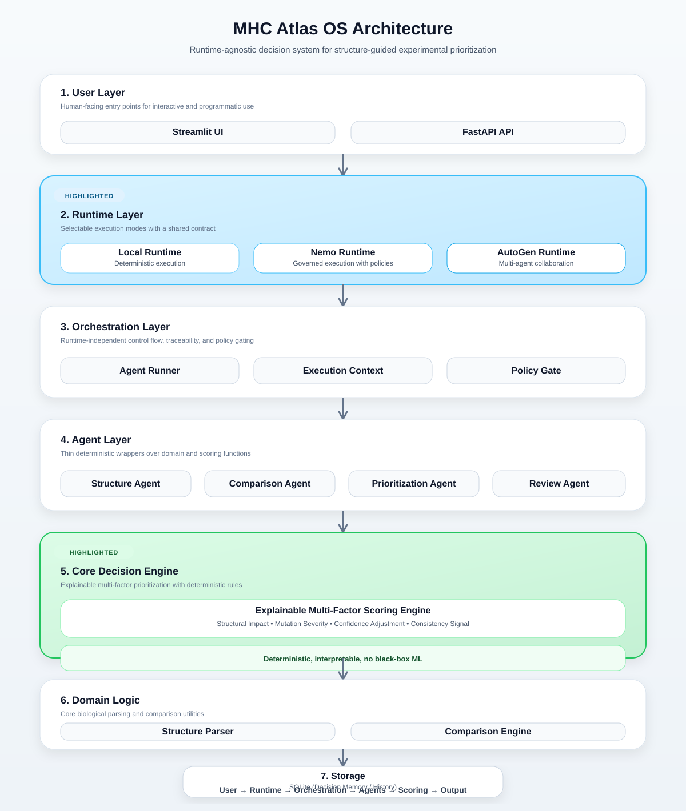
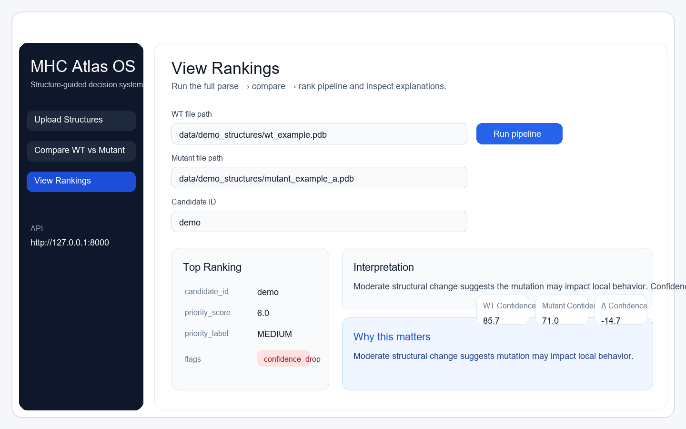

# MHC Atlas OS

A runtime-agnostic, policy-governed agent system for structure-guided experimental prioritization using AlphaFold-derived data.

Explainable • Multi-factor • Runtime-agnostic • Agent-driven

A Peptide-MHC Decision Platform for Structure-Guided Experimental Prioritization.

MHC Atlas OS is designed as a runtime-agnostic agent system for interpretable review workflows. It parses structure files, compares WT and mutant states, ranks candidates with multi-factor scoring, applies policy checks, and generates readable decision outputs through both an API and a lightweight UI.

## System Architecture



Runtime-agnostic architecture enabling deterministic, governed, and multi-agent execution modes.

## Key Capabilities
- Structure parsing (PDB/mmCIF)
- WT vs mutant comparison
- Explainable multi-factor scoring
- Policy-based decision rules
- API + UI interface
- Decision reports
- Decision memory tracking

This system does not attempt to predict binding affinity or biological outcomes directly.

Instead, it provides structured, explainable prioritization signals to guide experimental validation.

## Runtime Modes

- Local Runtime:
  deterministic pipeline execution

- Nemo Runtime:
  governed execution with policy enforcement and execution context

- AutoGen Runtime:
  multi-agent collaborative execution

## Design Philosophy

- no black-box ML
- explainable scoring
- policy-driven decisions
- runtime abstraction

The core system remains runtime-agnostic and portable across different execution frameworks while preserving deterministic domain logic.

## Scoring Model

The system uses a structured, multi-factor scoring model that integrates:

- Structural deviation metrics (geometric changes)
- Biochemical mutation severity (residue class transitions)
- Confidence signals (model reliability)
- Consistency signals across multiple indicators

This approach provides interpretable prioritization without relying on black-box machine learning models.

```text
User Input
   ↓
Runtime Layer (pluggable)
   ↓
Agent Orchestration
   ↓
Domain Logic (biology + scoring)
   ↓
Policy Engine
   ↓
Decision Output + Report + Memory
```

## Folder Structure

```text
core/
  runtime/
    base_runtime.py
    local_runtime.py
    nemo_runtime.py
    autogen_runtime.py
  orchestration/
  policies/

agents/
biology/
apps/
```

## Governed Runtime Mode

This project supports two primary governed execution patterns:

- Local Runtime for direct deterministic execution during development and testing
- Nemo Runtime for execution context, policy gating, logging, warnings, and traceability

This is a Nemo-style governed runtime architecture that prepares MHC Atlas OS for future integration with NVIDIA NemoClaw / OpenShell style execution environments.

## Quickstart
1. `pip install -r requirements.txt`
2. `uvicorn apps.api.main:app --reload`
3. `streamlit run apps/ui/app.py`

Open:
- `http://127.0.0.1:8000/docs`
- `http://127.0.0.1:8501`

## Example
Run the full pipeline with the demo structures:

```bash
curl -X POST "http://127.0.0.1:8000/pipeline" ^
  -H "Content-Type: application/json" ^
  -d "{\"wt_file\":\"data/demo_structures/wt_example.pdb\",\"mutant_file\":\"data/demo_structures/mutant_example_a.pdb\",\"candidate_id\":\"demo\"}"
```

Or use the same payload in the FastAPI docs page at `http://127.0.0.1:8000/docs`.

The `/pipeline` endpoint:
- parses the WT structure
- parses the mutant structure
- compares both structures
- ranks the candidate
- applies policy checks
- saves a decision record
- writes a markdown decision report under `reports/`

## Demo Workflow
1. Input WT and mutant structures
2. Run analysis
3. System outputs:
   - structural comparison
   - prioritization score
   - explanation
   - flags
4. Generate decision report

### End-to-End Demo Script

Run the scripted showcase:

```bash
python scripts/demo_showcase.py
```

What it demonstrates:
- single mutation analysis
- batch ranking shortlist
- decision history review
- governed runtime example

Demo talk track:

- “Here’s a wild-type and mutant structure”
- “This system explains why a mutation matters, not just scoring it”
- “Now instead of one mutation, I can evaluate 20 at once”
- “This gives me a shortlist of candidates to test experimentally”
- “And the system tracks past decisions, so we can compare over time”
- “The system is runtime-agnostic — I can run it locally or in a governed execution environment like Nemo-style systems with policy enforcement.”

## UI Preview



## Why This Matters

Most AlphaFold-based tools focus on structure prediction or visualization.

This system focuses on:
- decision-making
- prioritization
- explainability
- reproducibility

It is designed to assist in experimental planning, not replace it.
